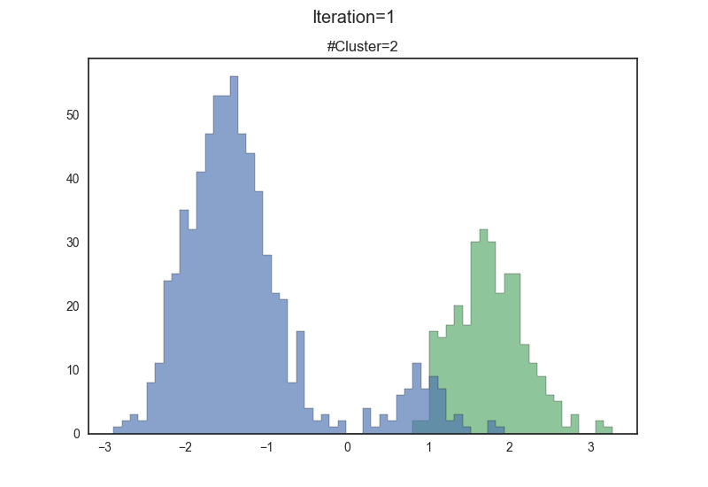
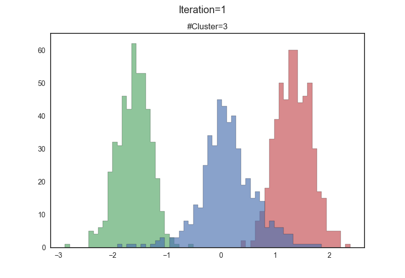
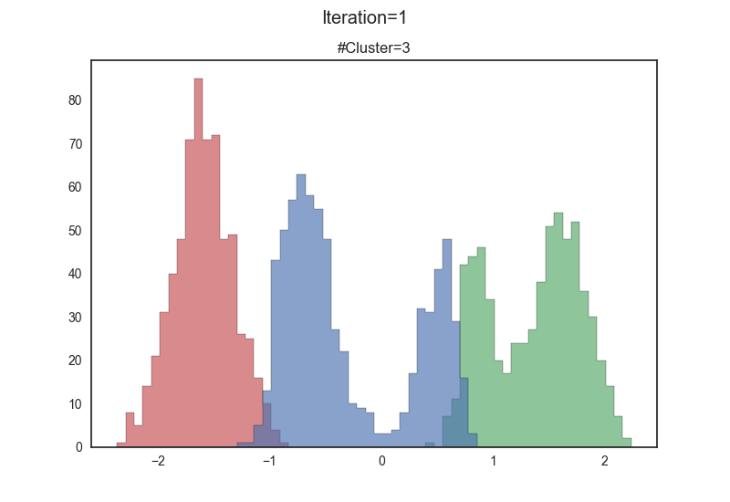
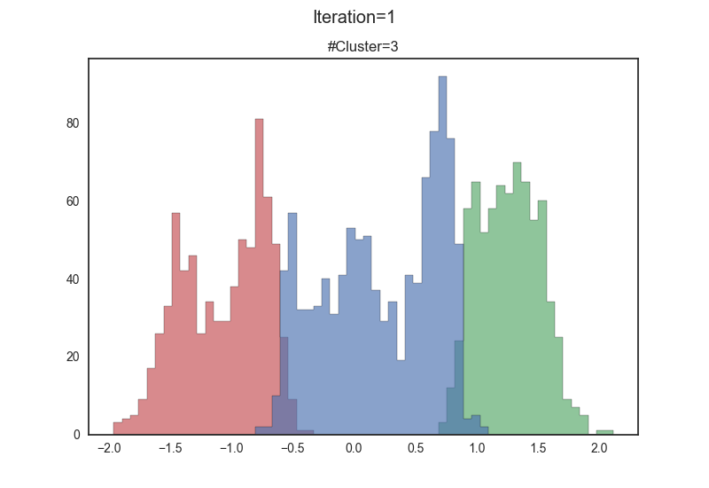
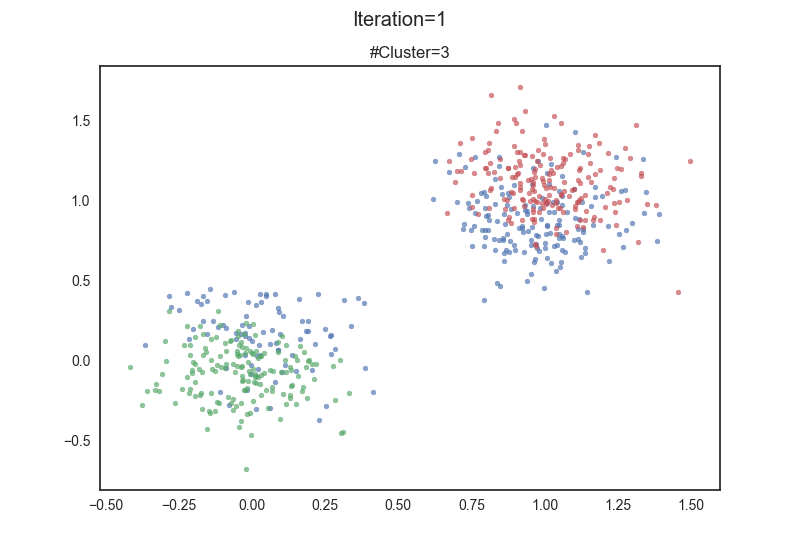
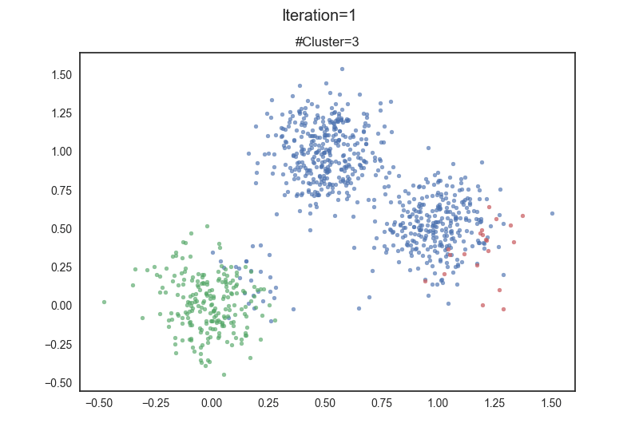
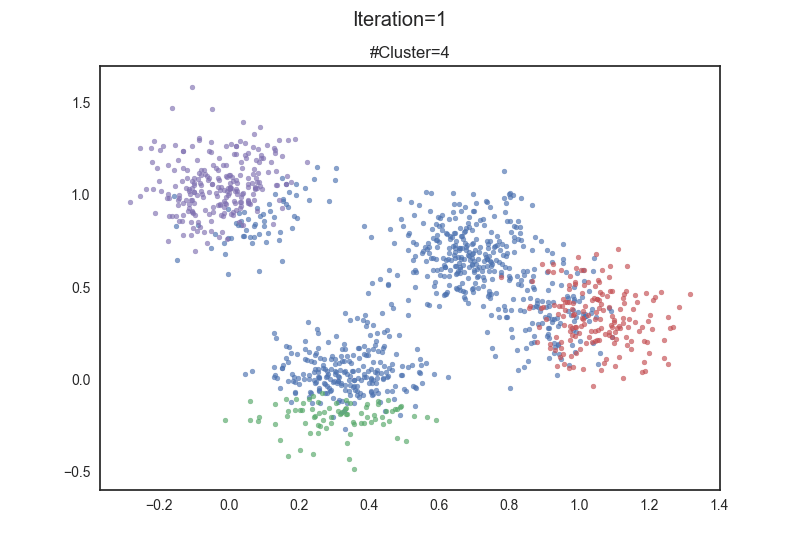
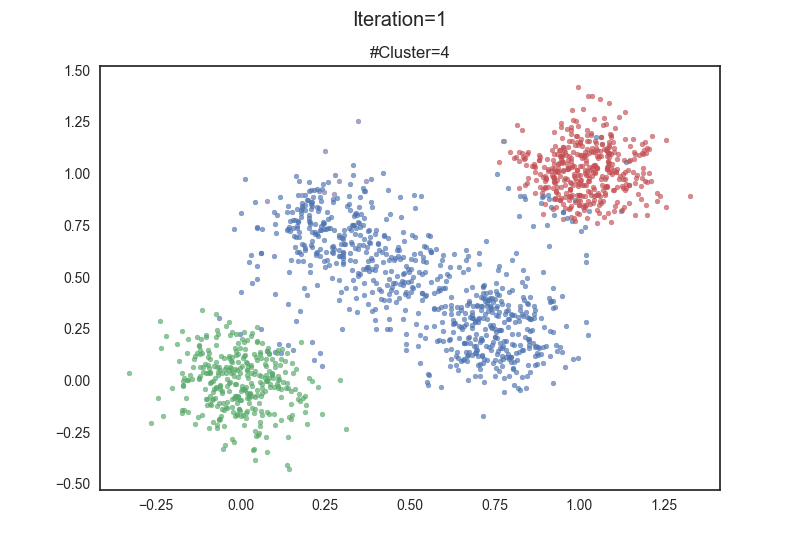

# dp-cluster

Python implementation of nonparametric bayesian clustering methods illustrated by *[Neal, 1998](http://www.stat.columbia.edu/npbayes/papers/neal_sampling.pdf)*.

## Results

**Algorithm 1**

**Algorithm 2**

- 2 clusters

- 3 clusters

- 4 clusters

- 5 clusters

- 2 clusters of 2D points

  

- 3 clusters of 2D points

  

- 4 clusters of 2D points

  

- 5 clusters of 2D points

