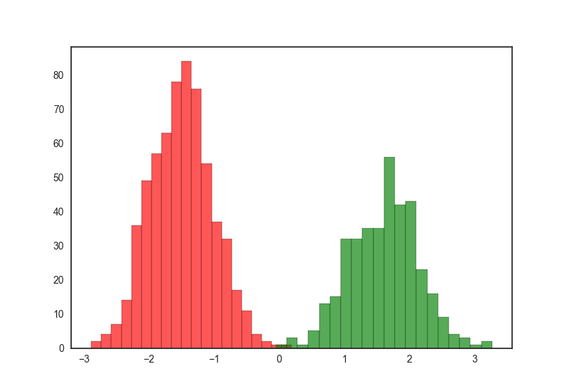
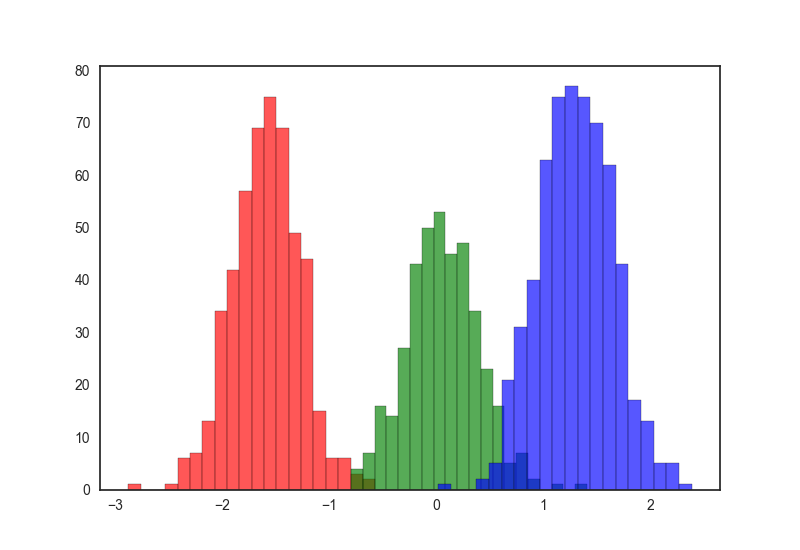
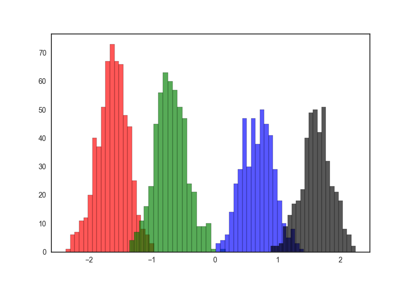
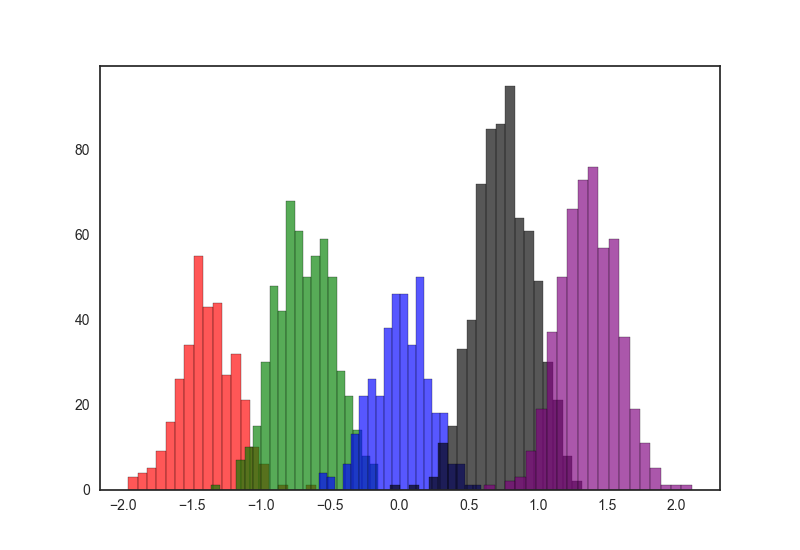
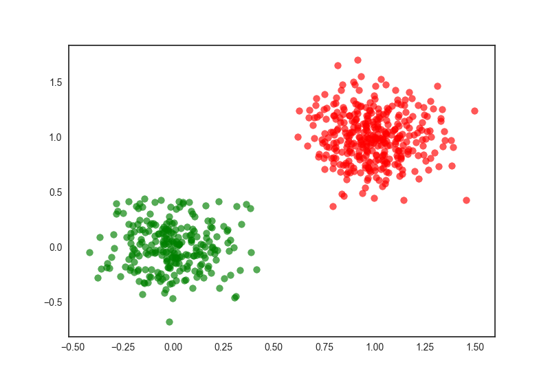
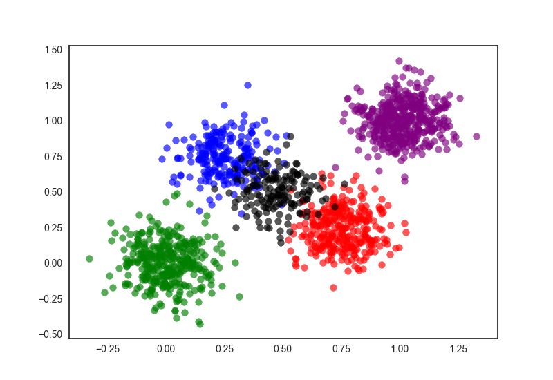

# Test-data
Generate test data for nonparametric bayesian clustering.

## 1-dimensional data
`scripts/1d_gen.py` generates 1-dimensional test data which forms 2, 3, 4, 5 clusters as tsv file. Generated data have distributions as below.

### 2 clusters

### 3 clusters

### 4 clusters

### 5 clusters

## 2-dimensional data
Similarly, `scripts/2d_gen.py` generates 2-dimensional test data which forms 2, 3, 4, 5 clusters as tsv file. Generated data have distributions as below.

### 2 clusters

### 3 clusters

### 4 clusters

### 5 clusters
